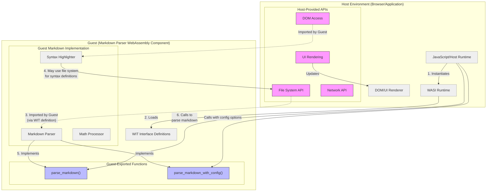

```mermaid
graph TB
    %% Define main containers
    subgraph "Host Environment (Browser/Application)"
        JS["JavaScript/Host Runtime"]
        DOM["DOM/UI Renderer"]
        WASI["WASI Runtime"]
        
        %% Host-provided functions
        subgraph "Host-Provided APIs"
            H1["File System API"]
            H2["Network API"]
            H3["DOM Access"]
            H4["UI Rendering"]
        end
    end
    
    subgraph "Guest (Markdown Parser WebAssembly Component)"
        WIT["WIT Interface Definitions"]
        
        subgraph "Guest Markdown Implementation"
            G1["Markdown Parser"]
            G2["Syntax Highlighter"]
            G3["Math Processor"]
        end
        
        subgraph "Guest-Exported Functions"
            E1["parse_markdown()"]
            E2["parse_markdown_with_config()"]
        end
    end
    
    %% Define relationships and data flow
    JS -- "1. Instantiates" --> WASI
    WASI -- "2. Loads" --> WIT
    
    %% Host → Guest function calls
    H1 -. "3. Imported by Guest\n(via WIT definition)" .-> G1
    H3 -. "Imported by Guest" .-> G2
    
    %% Guest implementation calls host functions
    G2 -- "4. May use file system\nfor syntax definitions" --> H1
    
    %% Guest → Host function calls (exports)
    G1 -- "5. Implements" --> E1
    G1 -- "Implements" --> E2
    
    %% Host calls guest exports
    JS -- "6. Calls to\nparse markdown" --> E1
    JS -- "Calls with config options" --> E2
    
    %% Host implementation details
    H4 -- "Updates" --> DOM
    
    %% Add descriptions
    classDef hostFn fill:#f9f,stroke:#333,stroke-width:1px
    classDef guestFn fill:#bbf,stroke:#333,stroke-width:1px
    classDef container fill:#efefef,stroke:#999,stroke-width:1px
    
    class H1,H2,H3,H4 hostFn
    class E1,E2 guestFn
    class JS,DOM,WASI,WIT,G1,G2,G3 container
```