# WebAssembly System Interface (WASI)

## What is WASI?

WASI (WebAssembly System Interface) is a modular system interface for WebAssembly. It provides a standardized way for WebAssembly modules to interact with system resources like file systems, network connections, clocks, and random numbers, as well as browser-specific capabilities like graphics and audio.

## Why WASI Matters for Web Development

### Bridge Between Systems and Browser Programming

WASI extends WebAssembly beyond the browser, creating a universal runtime that works consistently across browsers, servers, IoT devices, and more. For web developers, this means:

- **Write Once, Run Anywhere**: Code written for WASI can run in browsers, Node.js, Deno, and standalone WASI runtimes without modification
- **Language-Agnostic**: Use languages like Rust, C/C++, AssemblyScript, or Go for performance-critical code, while maintaining JavaScript for UI and DOM manipulation
- **Security by Design**: WASI's capability-based security model provides fine-grained access control, improving on the web security model

### The Component Model: A New Web Architecture

The WebAssembly Component Model builds on WASI to enable truly modular, interoperable components:

- **Language Interoperability**: Components written in different languages can seamlessly communicate
- **Standardized Interfaces**: WIT (WebAssembly Interface Types) provide clear contracts between components
- **Composability**: Build applications from plug-and-play components with defined interfaces

### Benefits for Web Applications

- **Performance**: Near-native speed for compute-intensive tasks like image/video processing, data visualization, and simulations
- **Advanced Capabilities**: Access to high-performance APIs like WebGPU through standardized interfaces
- **Reduced JavaScript Fatigue**: Use the right tool for each job rather than forcing everything into JavaScript
- **Smaller Downloads**: Ship optimized binary code that's often smaller than equivalent JavaScript
- **Battery Efficiency**: More efficient execution means better battery life on mobile devices

### Real-World Use Cases

- **Rich Media Processing**: Video editing, image manipulation, and audio processing
- **Data Visualization**: Complex data rendering and interactive visualizations
- **Gaming**: Physics engines, AI, procedural generation
- **Scientific Computing**: Machine learning, simulations, data analysis
- **Cryptography**: High-performance encryption and secure computations

## WASI-GFX: Graphics Capabilities for WebAssembly

[WASI-GFX](https://github.com/WebAssembly/wasi-gfx) is a collection of standardized interfaces for graphics programming in WebAssembly, enabling powerful visual applications across platforms. It consists of multiple related packages:

- **wasi:webgpu**: Access to GPU hardware acceleration via the WebGPU standard
- **wasi:frame-buffer**: CPU-based rendering for environments without GPU support
- **wasi:surface**: Canvas-like surface management for display and input events
- **wasi:graphics-context**: Connection layer between graphics APIs and surfaces

### How WASI-GFX Works: Host and Guest Model

```mermaid
graph TB
    %% Define main containers
    subgraph "Host Environment (Browser)"
        JS["JavaScript Runtime"]
        DOM["DOM/Canvas"]
        WASI["WASI Runtime"]
        
        %% Host-provided graphics functions
        subgraph "Host-Provided Graphics APIs"
            H1["wasi:surface API"]
            H2["wasi:webgpu API"]
            H3["GPU Hardware Access"]
            H4["Canvas Context"]
        end
    end
    
    subgraph "Guest (Rust WebAssembly Component)"
        WIT["WIT Interface Definitions"]
        
        subgraph "Guest Graphics Implementation"
            G1["Triangle Renderer"]
            G2["Shader Management"]
            G3["Frame Animation"]
        end
        
        subgraph "Guest-Exported Functions"
            E1["render_frame()"]
            E2["init_graphics()"]
            E3["handle_input()"]
        end
    end
    
    %% Define relationships and data flow
    JS -- "1. Instantiates" --> WASI
    WASI -- "2. Loads" --> WIT
    
    %% Host → Guest function calls
    H1 -. "3. Imported by Guest\n(via WIT definition)" .-> G1
    H2 -. "Imported by Guest" .-> G2
    H1 -. "Events (resize, pointer)" .-> G3
    
    %% Guest implementation calls host functions
    G1 -- "4. Calls surface API" --> H1
    G2 -- "Calls WebGPU API" --> H2
    H2 -- "Accesses" --> H3
    H1 -- "Renders to" --> H4
    
    %% Guest → Host function calls (exports)
    G1 -- "5. Implements" --> E1
    G2 -- "Implements" --> E2
    G3 -- "Implements" --> E3
    
    %% Host calls guest exports
    JS -- "6. Calls to\nstart rendering" --> E2
    JS -- "Calls per frame" --> E1
    JS -- "Forwards events" --> E3
    
    %% Host implementation details
    H4 -- "Updates" --> DOM
    
    %% Add descriptions
    classDef hostFn fill:#f9f,stroke:#333,stroke-width:1px
    classDef guestFn fill:#bbf,stroke:#333,stroke-width:1px
    classDef container fill:#efefef,stroke:#999,stroke-width:1px
    
    class H1,H2,H3,H4 hostFn
    class E1,E2,E3 guestFn
    class JS,DOM,WASI,WIT,G1,G2,G3 container
```



## WebGPU Triangle Example with WASI-GFX

### Definition in WIT

```wit
// world definition using WASI-GFX interfaces
world triangle-renderer {
  import wasi:webgpu/webgpu;
  import wasi:graphics-context/graphics-context;
  import wasi:surface/surface;

  export init-renderer;
  export render-frame;
}

// Exported interface for rendering
interface init-renderer {
  init: func();
}

interface render-frame {
  render: func() -> bool;
}
```

### Host Implementation (JavaScript)

```js
// Browser-side implementation of WASI-GFX interfaces
import { WasiGraphicsContext } from '@bytecodealliance/preview2-shim/graphics';
import { WasiSurface } from '@bytecodealliance/preview2-shim/surface';
import { WasiWebGPU } from '@bytecodealliance/preview2-shim/webgpu';

async function setupGraphicsComponent() {
  // Get the canvas element
  const canvas = document.getElementById('wasm-canvas');
  
  // Set up the WASI-GFX implementations
  const surface = new WasiSurface(canvas);
  const webgpu = new WasiWebGPU();
  const graphicsContext = new WasiGraphicsContext(canvas);
  
  // Load and instantiate the WebAssembly component
  const response = await fetch('triangle_renderer.wasm');
  const wasmModule = await WebAssembly.compileStreaming(response);
  
  // Connect the component to our host-provided implementations
  const instance = await WasiComponent.instantiate(wasmModule, {
    'wasi:webgpu/webgpu': webgpu,
    'wasi:graphics-context/graphics-context': graphicsContext,
    'wasi:surface/surface': surface
  });
  
  // Initialize the renderer
  instance.exports.init();
  
  // Set up animation loop
  function animate() {
    const continueAnimation = instance.exports.render();
    if (continueAnimation) {
      requestAnimationFrame(animate);
    }
  }
  
  // Start animation
  animate();
}

// Run the setup when the page loads
window.addEventListener('load', setupGraphicsComponent);
```

### Guest Implementation (Rust)

```rust
use wasi::webgpu::webgpu;
use wasi::graphics_context::graphics_context;
use wasi::surface::surface;

// Shared state for our renderer
struct TriangleRenderer {
    device: webgpu::GpuDevice,
    pipeline: webgpu::GpuRenderPipeline,
    context: graphics_context::Context,
}

static mut RENDERER: Option<TriangleRenderer> = None;

// Initialize WebGPU and create pipeline
fn create_render_pipeline(device: &webgpu::GpuDevice) -> webgpu::GpuRenderPipeline {
    // Vertex shader to draw a triangle
    let shader_module = device.create_shader_module(&webgpu::GpuShaderModuleDescriptor {
        code: r#"
            @vertex
            fn vs_main(@builtin(vertex_index) vertex_index: u32) -> @builtin(position) vec4<f32> {
                var positions = array<vec2<f32>, 3>(
                    vec2<f32>(0.0, 0.5),
                    vec2<f32>(-0.5, -0.5),
                    vec2<f32>(0.5, -0.5)
                );
                return vec4<f32>(positions[vertex_index], 0.0, 1.0);
            }

            @fragment
            fn fs_main() -> @location(0) vec4<f32> {
                return vec4<f32>(1.0, 0.0, 0.0, 1.0); // Red triangle
            }
        "#,
    });

    // Create the render pipeline
    device.create_render_pipeline(&webgpu::GpuRenderPipelineDescriptor {
        layout: device.create_pipeline_layout(&webgpu::GpuPipelineLayoutDescriptor {
            bind_group_layouts: &[],
        }),
        vertex: webgpu::GpuVertexState {
            module: shader_module,
            entry_point: "vs_main",
            buffers: &[],
        },
        fragment: Some(webgpu::GpuFragmentState {
            module: shader_module,
            entry_point: "fs_main",
            targets: &[webgpu::GpuColorTargetState {
                format: webgpu::GpuTextureFormat::RGBA8Unorm,
                blend: None,
                write_mask: webgpu::GpuColorWriteFlags::ALL,
            }],
        }),
        primitive: webgpu::GpuPrimitiveState {
            topology: webgpu::GpuPrimitiveTopology::TriangleList,
            strip_index_format: None,
            front_face: webgpu::GpuFrontFace::CCW,
            cull_mode: None,
        },
        depth_stencil: None,
        multisample: webgpu::GpuMultisampleState {
            count: 1,
            mask: !0,
            alpha_to_coverage_enabled: false,
        },
    })
}

// Implement the exported functions
#[export_name = "init"]
pub fn init() {
    // Get access to the GPU
    let gpu = webgpu::get_gpu();
    let adapter = gpu.request_adapter();
    let device = adapter.request_device();
    
    // Create a graphics context
    let context = graphics_context::Context::new();
    
    // Connect the device to the graphics context
    device.connect_graphics_context(&context);
    
    // Create the render pipeline
    let pipeline = create_render_pipeline(&device);
    
    // Store the renderer for later use
    unsafe {
        RENDERER = Some(TriangleRenderer {
            device,
            pipeline,
            context,
        });
    }
}

#[export_name = "render"]
pub fn render() -> bool {
    let renderer = unsafe { RENDERER.as_ref().unwrap() };
    
    // Get the next frame buffer from the graphics context
    let buffer = renderer.context.get_current_buffer();
    
    // Convert the abstract buffer to a WebGPU texture
    let texture = webgpu::GpuTexture::from_graphics_buffer(&buffer);
    let texture_view = texture.create_view();
    
    // Create a command encoder
    let encoder = renderer.device.create_command_encoder();
    
    // Begin a render pass
    let render_pass = encoder.begin_render_pass(&webgpu::GpuRenderPassDescriptor {
        color_attachments: &[webgpu::GpuRenderPassColorAttachment {
            view: texture_view,
            resolve_target: None,
            load_op: webgpu::GpuLoadOp::Clear,
            store_op: webgpu::GpuStoreOp::Store,
            clear_value: webgpu::GpuColor {
                r: 0.1,
                g: 0.2,
                b: 0.3,
                a: 1.0,
            },
        }],
        depth_stencil_attachment: None,
    });
    
    // Set the pipeline and draw the triangle
    render_pass.set_pipeline(&renderer.pipeline);
    render_pass.draw(3, 1, 0, 0);
    render_pass.end();
    
    // Submit the commands
    let command_buffer = encoder.finish();
    renderer.device.queue().submit(&[command_buffer]);
    
    // Present the frame
    renderer.context.present();
    
    // Continue animation
    true
}
```

This example demonstrates how WASI-GFX enables high-performance graphics applications using WebAssembly. The host (browser) provides implementations of the graphics interfaces, while the guest (Rust WebAssembly module) can use these interfaces to render graphics content without needing to know the underlying platform details.
