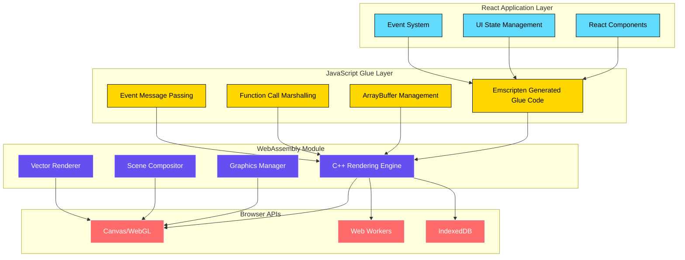
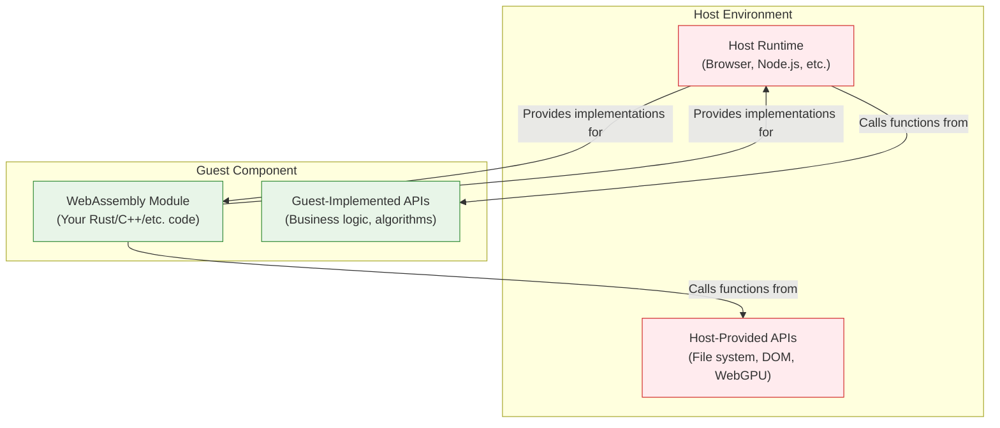
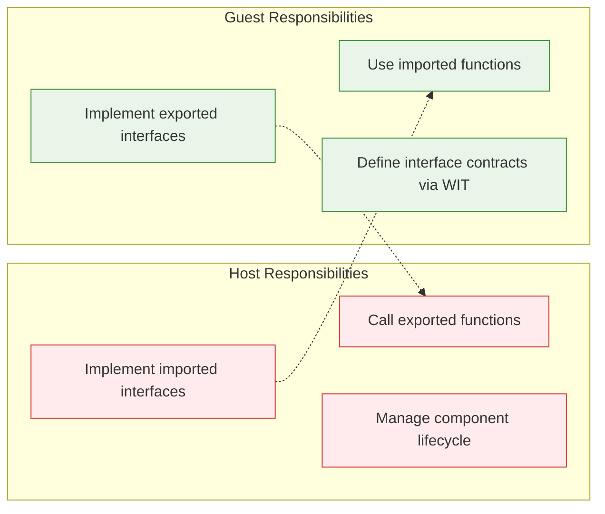

# Current Situation

The current state of WebAssembly integration often requires extensive JavaScript glue code to bridge the gap between web applications and WebAssembly modules, as illustrated below:


## The Traditional Approach: Figma's Emscripten Integration

[Figma](https://www.figma.com/blog/how-figma-draws-inspiration-from-the-gaming-world/) provides an excellent example of how traditional WebAssembly integration works using Emscripten to wrap a C++ rendering engine in a React application. This approach represents the "current situation" that the WIT Component Model aims to improve upon.


### How Figma's Architecture Works



### React Layer Integration

```typescript
// React component that wraps the Figma canvas
interface FigmaCanvasProps {
  documentId: string;
  onSelectionChange: (selection: NodeId[]) => void;
  onViewportChange: (viewport: Viewport) => void;
}

function FigmaCanvas({ documentId, onSelectionChange, onViewportChange }: FigmaCanvasProps) {
  const canvasRef = useRef<HTMLCanvasElement>(null);
  const engineRef = useRef<FigmaEngine | null>(null);
  
  useEffect(() => {
    if (!canvasRef.current) return;
    
    // Initialize the Emscripten-compiled engine
    FigmaEngine.create({
      canvas: canvasRef.current,
      wasmPath: '/figma-engine.wasm',
    }).then(engine => {
      engineRef.current = engine;
      
      // Set up event handlers that bridge React and C++
      engine.onSelectionChange = (nodeIds: number[]) => {
        onSelectionChange(nodeIds.map(id => ({ id })));
      };
      
      engine.onViewportChange = (x: number, y: number, zoom: number) => {
        onViewportChange({ x, y, zoom });
      };
      
      // Load the document into the C++ engine
      engine.loadDocument(documentId);
    });
    
    return () => {
      engineRef.current?.destroy();
    };
  }, [documentId]);
  
  // React event handlers that call into C++
  const handleMouseDown = useCallback((event: MouseEvent) => {
    if (!engineRef.current) return;
    
    const rect = canvasRef.current!.getBoundingClientRect();
    const x = event.clientX - rect.left;
    const y = event.clientY - rect.top;
    
    // Call into C++ engine via Emscripten glue code
    engineRef.current.handleMouseDown(x, y, event.button);
  }, []);
  
  return (
    <canvas
      ref={canvasRef}
      onMouseDown={handleMouseDown}
      style={{ width: '100%', height: '100%' }}
    />
  );
}
```

### Emscripten Glue Code Layer

```javascript
// Generated by Emscripten - simplified version
var Module = {
  // Memory management
  HEAP8: null,
  HEAP16: null,
  HEAP32: null,
  HEAPF32: null,
  HEAPF64: null,
  
  // Function exports from C++
  _figma_engine_create: null,
  _figma_engine_load_document: null,
  _figma_engine_handle_mouse_down: null,
  _figma_engine_render_frame: null,
  
  // JavaScript functions called from C++
  js_selection_changed: function(nodeIdsPtr, count) {
    const nodeIds = [];
    for (let i = 0; i < count; i++) {
      nodeIds.push(Module.HEAP32[(nodeIdsPtr >> 2) + i]);
    }
    
    // Bridge to React
    if (window.figmaCanvasInstance) {
      window.figmaCanvasInstance.onSelectionChange(nodeIds);
    }
  },
  
  js_request_animation_frame: function() {
    requestAnimationFrame(() => {
      Module._figma_engine_render_frame();
    });
  },
  
  js_console_log: function(messagePtr) {
    const message = UTF8ToString(messagePtr);
    console.log('[Figma Engine]', message);
  }
};

// High-level JavaScript API that React uses
class FigmaEngine {
  constructor(moduleInstance) {
    this.module = moduleInstance;
    this.enginePtr = null;
  }
  
  static async create(options) {
    // Load the WebAssembly module
    const module = await createModule();
    const engine = new FigmaEngine(module);
    
    // Initialize the C++ engine
    engine.enginePtr = module._figma_engine_create(
      options.canvas.width,
      options.canvas.height
    );
    
    return engine;
  }
  
  loadDocument(documentId) {
    const documentIdPtr = this.module.stringToNewUTF8(documentId);
    this.module._figma_engine_load_document(this.enginePtr, documentIdPtr);
    this.module._free(documentIdPtr);
  }
  
  handleMouseDown(x, y, button) {
    this.module._figma_engine_handle_mouse_down(this.enginePtr, x, y, button);
  }
}
```

### C++ Engine Core

```cpp
// Simplified C++ engine core
class FigmaEngine {
private:
    std::unique_ptr<SceneGraph> scene_graph_;
    std::unique_ptr<Renderer> renderer_;
    std::vector<NodeId> selected_nodes_;
    
public:
    FigmaEngine(int canvas_width, int canvas_height) {
        renderer_ = std::make_unique<Renderer>(canvas_width, canvas_height);
        scene_graph_ = std::make_unique<SceneGraph>();
    }
    
    void load_document(const std::string& document_id) {
        // Load document data (possibly from IndexedDB via JS calls)
        auto document_data = load_document_data(document_id);
        scene_graph_->load_from_data(document_data);
        
        // Trigger re-render
        request_animation_frame();
    }
    
    void handle_mouse_down(float x, float y, int button) {
        // Hit testing
        auto hit_node = scene_graph_->hit_test(x, y);
        
        if (hit_node) {
            selected_nodes_ = {hit_node->id()};
            
            // Call back to JavaScript
            std::vector<uint32_t> node_ids;
            for (const auto& node : selected_nodes_) {
                node_ids.push_back(node.value);
            }
            
            // This calls the JavaScript function
            js_selection_changed(node_ids.data(), node_ids.size());
        }
    }
    
    void render_frame() {
        renderer_->clear();
        scene_graph_->render(*renderer_);
        renderer_->present();
        
        // Schedule next frame
        request_animation_frame();
    }
};

// Emscripten bindings
extern "C" {
    EMSCRIPTEN_KEEPALIVE
    FigmaEngine* figma_engine_create(int width, int height) {
        return new FigmaEngine(width, height);
    }
    
    EMSCRIPTEN_KEEPALIVE
    void figma_engine_load_document(FigmaEngine* engine, const char* document_id) {
        engine->load_document(std::string(document_id));
    }
    
    EMSCRIPTEN_KEEPALIVE
    void figma_engine_handle_mouse_down(FigmaEngine* engine, float x, float y, int button) {
        engine->handle_mouse_down(x, y, button);
    }
    
    EMSCRIPTEN_KEEPALIVE
    void figma_engine_render_frame(FigmaEngine* engine) {
        engine->render_frame();
    }
}

// JavaScript interface functions (called from C++)
extern "C" {
    void js_selection_changed(uint32_t* node_ids, int count);
    void js_request_animation_frame();
    void js_console_log(const char* message);
}
```

### Challenges with the Traditional Approach

1. **Manual Glue Code**: Extensive JavaScript glue code needed to bridge types and calling conventions
2. **Memory Management**: Manual management of WebAssembly memory for passing complex data
3. **Type Safety**: No compile-time guarantees about interface contracts
4. **Debugging Complexity**: Difficult to debug across the JavaScript/WebAssembly boundary
5. **Bundle Size**: Emscripten generates significant overhead code

### How WIT Component Model Improves This

The WIT approach we documented above addresses these issues:

```wit
// Instead of manual glue code, define clean interfaces
world figma-engine {
    // Host (React) provides these to guest (C++ engine)
    import canvas-api;
    import document-storage;
    import animation-frame;
    
    // Guest (C++ engine) provides these to host (React)  
    export rendering-engine;
    export selection-manager;
    export viewport-controller;
}

interface rendering-engine {
    load-document: func(document-id: string);
    render-frame: func();
    handle-input: func(event: input-event);
}

interface selection-manager {
    get-selection: func() -> list<node-id>;
    set-selection: func(nodes: list<node-id>);
}
```

**Benefits of WIT approach:**
- **Type Safety**: Interfaces are statically defined and checked
- **No Manual Glue Code**: Bindings are generated automatically
- **Language Agnostic**: Same interface works with Rust, C++, Go, etc.
- **Smaller Bundle Size**: No Emscripten runtime overhead
- **Better Debugging**: Clear interface boundaries with proper error handling
- **Composability**: Engines can be mixed and matched across different hosts

The WIT Component Model represents the evolution from manual, error-prone integration patterns toward a more robust, type-safe, and maintainable approach to WebAssembly integration.

# WebAssembly Interface Types (WIT) and the Host-Guest Model

## What are WIT Worlds?

A **WIT World** is a contract that defines the complete interface of a WebAssembly component. It specifies what functionality the component needs from its environment (imports) and what functionality it provides to its environment (exports). Think of it as an API specification that works across different programming languages and runtime environments.

## Host vs Guest: Who Does What?

In the WebAssembly Component Model:

- **Host**: The runtime environment that loads and executes WebAssembly components (e.g., browser, Node.js, or a WASI runtime)
- **Guest**: The WebAssembly component itself (e.g., your Rust code compiled to WebAssembly)



## Understanding Imports and Exports

### Imports: What the Guest Needs from the Host
When a WebAssembly component **imports** an interface, it means:
- The **guest** (WebAssembly component) declares it needs certain functionality
- The **host** (runtime environment) must provide implementations of those functions
- The **guest** calls these functions during execution

### Exports: What the Guest Provides to the Host
When a WebAssembly component **exports** an interface, it means:
- The **guest** (WebAssembly component) implements and provides certain functionality
- The **host** (runtime environment) can call these functions
- The **guest** must provide the actual implementation

## Example: Browser Interaction World

Let's imagine a `browser.wit` that defines how a WebAssembly component interacts with browser APIs:

```wit
// browser.wit - A conceptual example
package browser:api@1.0.0;

world browser-app {
    // IMPORTS: Host (browser) provides these to Guest (WebAssembly)
    import dom-manipulation;     // Browser implements DOM APIs
    import fetch-api;           // Browser implements HTTP requests  
    import local-storage;       // Browser implements storage APIs
    import console-logging;     // Browser implements console.log, etc.
    
    // EXPORTS: Guest (WebAssembly) provides these to Host (browser)  
    export app-lifecycle;       // WebAssembly implements app startup/shutdown
    export event-handlers;      // WebAssembly implements click handlers, etc.
    export data-processing;     // WebAssembly implements business logic
}

// Host-provided interfaces (browser implements these)
interface dom-manipulation {
    create-element: func(tag: string) -> element-id;
    set-text-content: func(element: element-id, text: string);
    append-child: func(parent: element-id, child: element-id);
    query-selector: func(selector: string) -> option<element-id>;
}

interface fetch-api {
    request: func(url: string, options: request-options) -> result<response, fetch-error>;
}

interface console-logging {
    log: func(message: string);
    error: func(message: string);
}

// Guest-provided interfaces (WebAssembly implements these)
interface app-lifecycle {
    init: func();
    cleanup: func();
}

interface event-handlers {
    handle-click: func(element: element-id, x: f32, y: f32);
    handle-input: func(element: element-id, value: string);
}

interface data-processing {
    process-user-data: func(data: list<u8>) -> result<processed-data, processing-error>;
    validate-form: func(form-data: form-inputs) -> validation-result;
}
```

### Host Implementation (JavaScript in Browser)

```javascript
// Browser (host) provides implementations for imported interfaces
const domAPI = {
    createElement: (tag) => {
        const element = document.createElement(tag);
        const id = generateElementId();
        elementRegistry.set(id, element);
        return id;
    },
    setTextContent: (elementId, text) => {
        const element = elementRegistry.get(elementId);
        element.textContent = text;
    },
    // ... other DOM methods
};

const fetchAPI = {
    request: async (url, options) => {
        try {
            const response = await fetch(url, options);
            return { ok: response, err: null };
        } catch (error) {
            return { ok: null, err: error };
        }
    }
};

// Load and instantiate the WebAssembly component
const wasmModule = await WebAssembly.instantiateStreaming(
    fetch('app.wasm'),
    {
        'browser:api/dom-manipulation': domAPI,
        'browser:api/fetch-api': fetchAPI,
        'browser:api/console-logging': console,
        // ... other host-provided implementations
    }
);

// Host calls guest-exported functions
wasmModule.instance.exports.init();

// Set up event listeners that call into WebAssembly
document.addEventListener('click', (event) => {
    const elementId = getElementId(event.target);
    wasmModule.instance.exports.handleClick(elementId, event.x, event.y);
});
```

### Guest Implementation (Rust WebAssembly)

```rust
// Import interfaces provided by the host (browser)
use browser::api::{dom_manipulation, fetch_api, console_logging};

// Implement interfaces exported to the host
wit_bindgen::generate!({
    path: "wit",
    world: "browser-app",
});

struct BrowserApp;

// Implement exported interfaces
impl Guest for BrowserApp {
    fn init() {
        console_logging::log("WebAssembly app initializing");
        
        // Use host-provided DOM API
        let container = dom_manipulation::query_selector("#app-container").unwrap();
        let title = dom_manipulation::create_element("h1");
        dom_manipulation::set_text_content(title, "Hello from WebAssembly!");
        dom_manipulation::append_child(container, title);
    }
    
    fn handle_click(element_id: ElementId, x: f32, y: f32) {
        console_logging::log(&format!("Clicked at ({}, {})", x, y));
        
        // Process the click using host-provided APIs
        let button = dom_manipulation::create_element("button");
        dom_manipulation::set_text_content(button, "Clicked!");
        // ... more processing
    }
    
    fn process_user_data(data: Vec<u8>) -> Result<ProcessedData, ProcessingError> {
        // Complex data processing that benefits from WebAssembly's speed
        let processed = expensive_algorithm(data);
        Ok(processed)
    }
}
```

## Real Examples from This Codebase

### 1. Markdown Parser - Guest Exports to Host

From `crates/wasi-markdown/wit/world.wit`:

```wit
world markdown {
    // Guest exports parsing functionality to host
    export parser;  
}

interface parser {
    // Host can call these functions implemented by the guest
    parse-markdown: func(input: string) -> string;
    parse-markdown-with-config: func(
        input: string,
        enable-syntax-highlighting: bool,
        enable-math: bool
    ) -> string;
}
```

**Flow**: Host (JavaScript) → calls → Guest (Rust WebAssembly)
- JavaScript provides markdown text
- Rust processes it and returns HTML
- JavaScript displays the result

### 2. Graphics Triangle - Guest Imports from Host

From `crates/wasi-basic-triangle/wit/example.wit`:

```wit
world example {
    // Guest imports graphics capabilities from host
    import wasi:webgpu/webgpu@0.0.1;
    import wasi:graphics-context/graphics-context@0.0.1;
    import wasi:surface/surface@0.0.1;
}
```

**Flow**: Guest (Rust WebAssembly) → calls → Host (Browser WebGPU APIs)
- Rust requests GPU device and resources
- Browser provides WebGPU implementations
- Rust renders graphics using host-provided APIs

### 3. TSX Processing Pipeline - Guest Exports Processing

From `crates/wasi-etch-tsx/wit/world.wit`:

```wit
world etch-tsx {
    export pipeline;
}

interface pipeline {
    resource tsx-pipeline {
        constructor(input: string);
        run: func() -> result<string, tsx-error>;
    }
}
```

**Flow**: Host (JavaScript) → calls → Guest (Rust WebAssembly)
- JavaScript provides TSX source code
- Rust processes and transforms it
- JavaScript receives transformed output

## Key Benefits of This Model

1. **Language Interoperability**: Write performance-critical code in Rust/C++ while keeping UI logic in JavaScript
2. **Security**: WebAssembly components run in a sandboxed environment with explicit capabilities
3. **Modularity**: Components can be composed and reused across different host environments
4. **Performance**: Leverage native-speed execution for computationally intensive tasks
5. **Platform Portability**: Same WebAssembly component can run in browsers, servers, and edge environments

## The Two-Way Contract



This model creates a powerful ecosystem where hosts and guests can provide complementary capabilities to each other, enabling new architectures that combine the best of different technologies and runtime environments.
