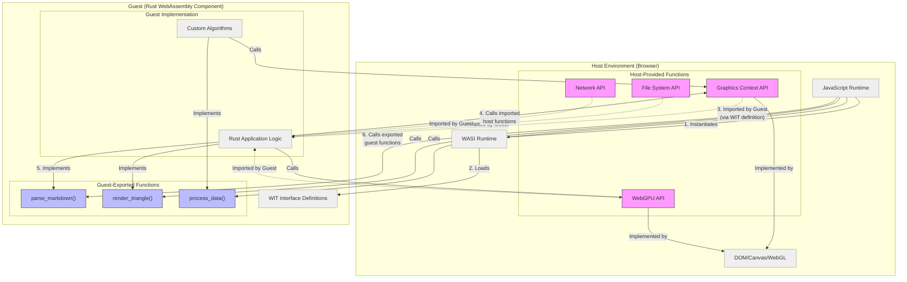

Definition in WIT:

```wit
   world graphics-app {
     import wasi:graphics-context/graphics-context;
   }
```

Host Implementation (JavaScript):

```js
// Browser provides implementation
const graphicsContext = {
  drawTriangle: (x1, y1, x2, y2, x3, y3) => {
    const ctx = canvas.getContext("2d");
    ctx.beginPath();
    ctx.moveTo(x1, y1);
    ctx.lineTo(x2, y2);
    ctx.lineTo(x3, y3);
    ctx.closePath();
    ctx.fill();
  },
};

// Pass implementation to component
const instance = await WasiComponent.instantiate(wasmModule, {
  "wasi:graphics-context/graphics-context": graphicsContext,
});
```

Guest Usage (Rust):

```rust
      // Generated bindings from wit-bindgen
   use wasi::graphics_context::graphics_context;

   pub fn draw_shape() {
     // Call host-provided function
     graphics_context::draw_triangle(0.0, 0.0, 1.0, 0.0, 0.5, 1.0);
   }
```

Host Usage (JavaScript):

```js
// Instantiate the component
const instance = await WasiComponent.instantiate(wasmModule);

// Call Rust-implemented function from JavaScript
const htmlOutput = instance.exports.parseMarkdown("# Hello World");
document.getElementById("content").innerHTML = htmlOutput;
```
